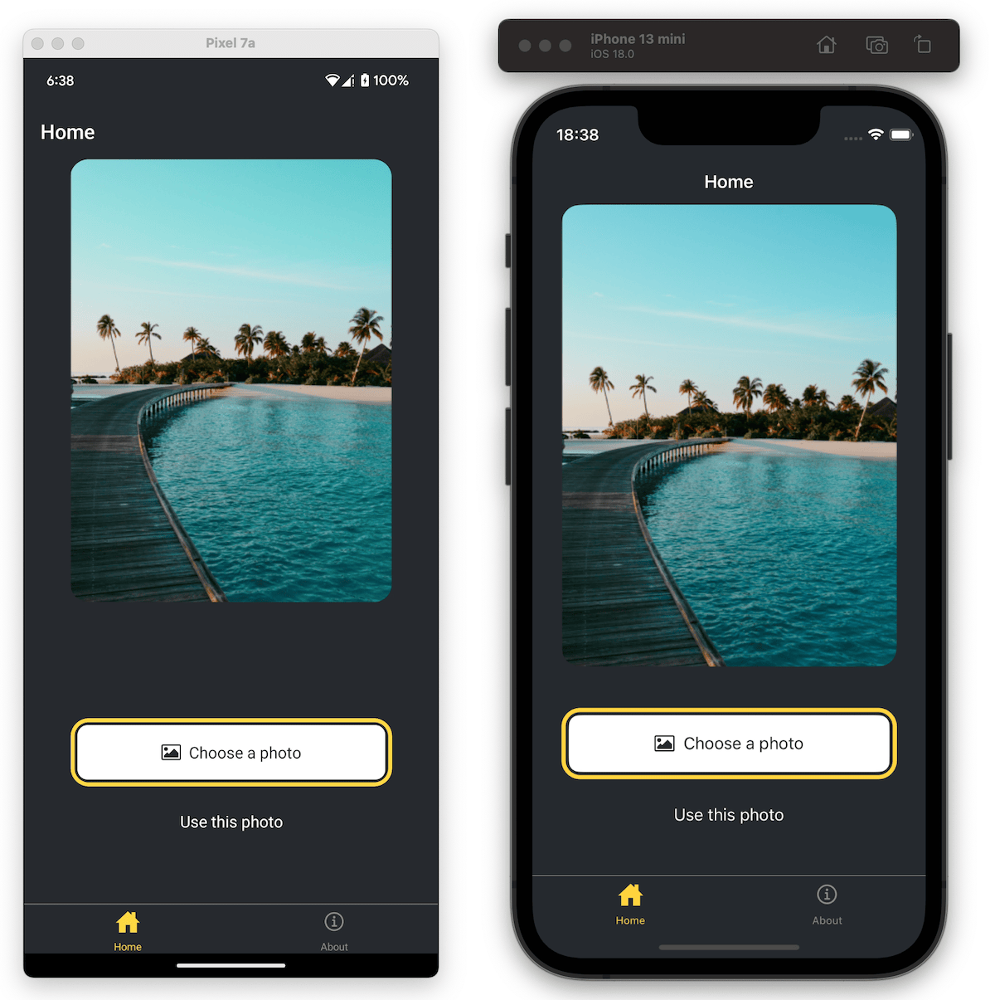

<div align='center'>

# 📱 Expo: StickerSmash App

</div>

### Aplicación creada a partir del curso oficial de Expo.

<div align='center'>

  

</div>

## 🚀 Descripción

Este proyecto es una aplicación creada para aprender a utilizar el framework **Expo** con el objetivo crear aplicaciones móviles.

Es parte del [**curso oficial de Expo**](https://docs.expo.dev/tutorial/introduction/) para aprender a utilizar la herramienta.

## ⚡ Comenzar

### Prerrequisitos

1. Git.
2. Node.js: cualquier versión a partir de la 18 o superior.
3. Expo Go o un emulador de dispositivos móviles.

## 🔧 Instalación

### Usando npm

1. **Clona el repositorio:**

   ```bash
   git clone https://github.com/abrahamgalue/expo-learning-course.git
   cd expo-learning-course
   ```

2. **Instala las dependencias:**

   ```bash
   npm install
   ```

### Ejecución local (modo desarrollo)

1. **Inicia el servidor de desarrollo:**

   ```bash
   npx expo start
   ```

   Esto iniciará el servidor de desarrollo de Expo, para utilizar la aplicación te recomiendo seguir la [**guía detallada de Expo para configurar tu entorno**](https://docs.expo.dev/get-started/set-up-your-environment/).

## 🎭 Tecnologías

- [**React Native**](https://reactnative.dev/) Para crear aplicaciones móviles. 
- [**Expo**](https://expo.dev/) Como framework de RN.